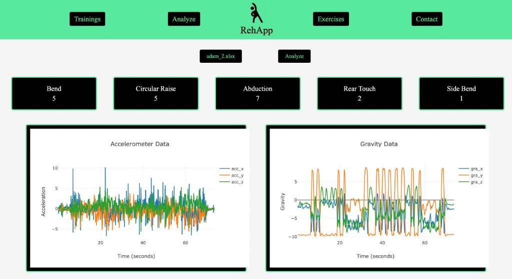
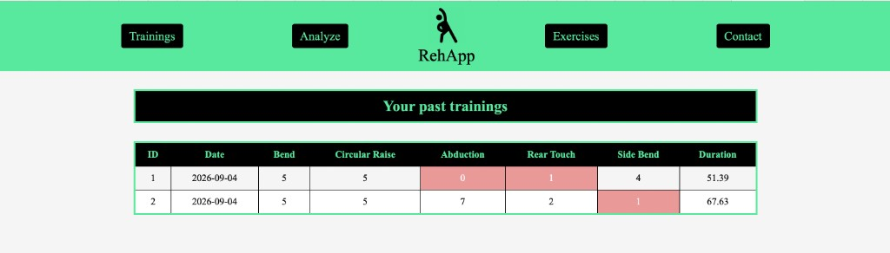
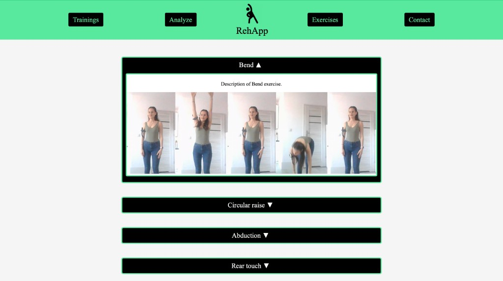
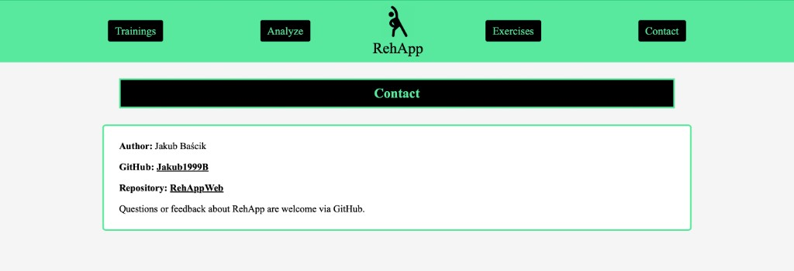

# RehApp

Web app for recognizing rehabilitation exercises from phone sensor recordings. Upload an Excel file with accelerometer, gravity, gyroscope, and orientation data; RehApp classifies activities with an LSTM model, counts repetitions, and stores each session in a training history.

## Features

- **Analyze** — upload a sensor `.xlsx` file, get exercise counts and interactive sensor charts
- **Trainings** — browse past analysis sessions; low repetition counts are highlighted
- **Exercises** — accordion guide for supported rehab movements with step photos
- **Contact** — author and repository links

Recognized activities: bend, circular raise, abduction, rear touch, and side bend.

## Screenshots

### Analyze



### Trainings



### Exercises



### Contact



## Project structure

```
RehAppWeb/
├── backend/
│   ├── RehAppAPI.py          # FastAPI application entry point
│   ├── templates/            # HTML pages
│   ├── static/               # CSS and images
│   └── prediction/           # LSTM inference and repetition counting
│       └── models/           # Model used at runtime
├── data_processing/          # Helpers for loading train/test/val splits
├── docs/screenshots/         # UI screenshots
├── saved_models/             # Saved TensorFlow model artifacts
├── requirements.txt
└── README.md
```

Datasets under `data/` and `backend/data/` are local only (listed in `.gitignore`) and are not part of the repository.

## Requirements

- Python 3.10+
- Dependencies listed in `requirements.txt` (FastAPI, TensorFlow/Keras, pandas, etc.)

## Setup

```bash
python -m venv .venv
source .venv/bin/activate   # Windows: .venv\Scripts\activate
pip install -r requirements.txt
```

## Run

From the `backend` directory (so template, static, and model paths resolve correctly):

```bash
cd backend
python RehAppAPI.py
```

Or with Uvicorn:

```bash
cd backend
uvicorn RehAppAPI:app --reload --host 127.0.0.1 --port 8000
```

Open [http://127.0.0.1:8000](http://127.0.0.1:8000).

The training history database (`trainings.db`) is created automatically on first run and is also gitignored.

## Excel input format

Uploads should be `.xlsx` files with at least these columns:

| Column | Description |
| --- | --- |
| `seconds_elapsed` | Time axis |
| `acc_x`, `acc_y`, `acc_z` | Accelerometer |
| `gra_x`, `gra_y`, `gra_z` | Gravity |
| `gyr_x`, `gyr_y`, `gyr_z` | Gyroscope |
| `ori_x`, `ori_y`, `ori_z` | Orientation |

## Author

**Jakub Baścik** — [Jakub1999B](https://github.com/Jakub1999B)

Repository: [RehAppWeb](https://github.com/Jakub1999B/RehAppWeb)

Questions or feedback about RehApp are welcome via GitHub.
